# Guide des Diagrammes UML - Application de Gestion Immobilière

## 📋 Table des Matières
1. [Diagramme de Cas d'Utilisation](#diagramme-de-cas-dutilisation)
2. [Diagramme de Classes](#diagramme-de-classes)
3. [Diagramme de Séquence](#diagramme-de-séquence)
4. [Diagramme d'Activités](#diagramme-dactivités)
5. [Diagramme d'États](#diagramme-détats)
6. [Diagramme de Composants](#diagramme-de-composants)
7. [Diagramme de Déploiement](#diagramme-de-déploiement)
8. [Diagramme de Contexte](#diagramme-de-contexte)

---

## 🎯 Diagramme de Cas d'Utilisation

### Acteurs Principaux
- **Propriétaire** : Gère ses biens, reçoit des demandes, envoie des contrats
- **Locataire** : Cherche des biens, demande des visites, gère ses contrats

### Systèmes Externes
- **CaurisPay API** : Système de paiement externe pour les transactions

### Cas d'Utilisation Principaux

#### Diagramme Complet avec Include/Extend
```mermaid
graph TD
    subgraph "Acteurs"
        P[Propriétaire]
        L[Locataire]
    end

    subgraph "Système Externe"
        CP[CaurisPay API]
    end

    subgraph "Cas d'Utilisation Principaux"
        UC1[S'authentifier]
        UC2[S'inscrire]
        UC3[Gérer les biens]
        UC4[Gérer les demandes de visite]
        UC5[Gérer les contrats]
        UC6[Messagerie]
        UC7[Rechercher des biens]
        UC8[Demande de visite]
        UC9[Gérer les paiements]
        UC10[Notifications]
        UC11[Reçus et factures]
        UC12[Suivi des loyers]
    end

    subgraph "Cas d'Utilisation de Paiement"
        UC13[Initier paiement]
        UC14[Vérifier statut paiement]
        UC15[Choisir méthode paiement]
        UC16[Remboursement]
        UC17[Historique paiements]
        UC18[Reçu PDF]
    end

    subgraph "Cas d'Utilisation Système"
        UC21[Génération signature]
        UC22[Validation données]
        UC23[Gestion erreurs]
    end

    %% Relations Include
    UC3 --> UC22
    UC4 --> UC22
    UC5 --> UC22
    UC8 --> UC22
    UC9 --> UC22
    UC13 --> UC22
    UC14 --> UC22
    UC15 --> UC22
    UC16 --> UC22

    UC9 --> UC10
    UC9 --> UC11
    UC9 --> UC12
    UC9 --> UC17
    UC9 --> UC18

    UC13 --> UC14
    UC13 --> UC15
    UC13 --> UC21
    UC14 --> UC21
    UC16 --> UC21

    %% Relations Extend
    UC5 -.-> UC9: <<extend>>

    %% Acteurs et cas d'utilisation
    P --> UC1
    P --> UC2
    P --> UC3
    P --> UC4
    P --> UC5
    P --> UC6
    P --> UC9
    P --> UC10
    P --> UC11
    P --> UC12

    L --> UC1
    L --> UC2
    L --> UC7
    L --> UC8
    L --> UC6
    L --> UC9
    L --> UC10
    L --> UC11
    L --> UC17
    L --> UC18

    %% Système externe et cas d'utilisation
    CP -.-> UC13: <<fournit>>
    CP -.-> UC14: <<fournit>>
    CP -.-> UC21: <<fournit>>
```

#### Pour le Propriétaire
```
┌─────────────────────────────────────────────────────────────┐
│                     PROPRIÉTAIRE                        │
├─────────────────────────────────────────────────────────────┤
│  🔐 S'authentifier                                     │
│  📝 S'inscrire                                         │
│  🏠 Gérer ses biens                                    │
│    ├─ Ajouter un bien                                   │
│    ├─ Modifier un bien                                  │
│    ├─ Supprimer un bien                                 │
│    └─ Voir la liste des biens                           │
│  📋 Gérer les demandes de visite                       │
│    ├─ Voir les demandes                                │
│    ├─ Accepter/Refuser une demande                      │
│    └─ Répondre aux messages                            │
│  📄 Gérer les contrats                                 │
│    ├─ Inviter un locataire                             │
│    ├─ Créer un contrat                                │
│    ├─ Suivre les paiements                            │
│    └─ Gérer les loyers mensuels                       │
│  💳 Gérer les paiements                               │
│    ├─ Voir les paiements reçus                        │
│    ├─ Générer des reçus                               │
│    ├─ Suivre les impayés                              │
│    ├─ Envoyer des relances                            │
│    └─ Demander des remboursements                     │
│  📊 Rapports et statistiques                          │
│    ├─ Rapport de revenus                              │
│    ├─ Statistiques de paiement                        │
│    ├─ Historique des transactions                    │
│    └─ Export des données                              │
│  💬 Messagerie                                         │
│    ├─ Envoyer des messages                             │
│    ├─ Recevoir des messages                            │
│    └─ Voir l'historique                              │
│  🔔 Notifications                                      │
│    ├─ Notifications de paiement                      │
│    ├─ Notifications de visite                         │
│    ├─ Notifications de contrat                         │
│    └─ Alerte d'impayé                                │
└─────────────────────────────────────────────────────────────┘
```

#### Pour le Locataire
```
┌─────────────────────────────────────────────────────────────┐
│                      LOCATAIRE                          │
├─────────────────────────────────────────────────────────────┤
│  🔐 S'authentifier                                     │
│  📝 S'inscrire                                         │
│  🔍 Rechercher des biens                                │
│    ├─ Filtrer par critères                             │
│    ├─ Voir les détails                                 │
│    └─ Sauvegarder les favoris                         │
│  📅 Demander une visite                                │
│    ├─ Sélectionner un bien                              │
│    ├─ Choisir une date                                │
│    └─ Envoyer la demande                              │
│  📋 Gérer les demandes                                 │
│    ├─ Voir l'état des demandes                        │
│    └─ Annuler une demande                             │
│  📄 Gérer les contrats                                 │
│    ├─ Voir les invitations                            │
│    ├─ Accepter/Refuser un contrat                     │
│    ├─ Télécharger le contrat                          │
│    └─ Voir les échéances                             │
│  💳 Effectuer les paiements                           │
│    ├─ Payer le loyer                                 │
│    ├─ Choisir la méthode de paiement                  │
│    ├─ Voir l'historique des paiements                │
│    ├─ Télécharger les reçus                          │
│    └─ Demander un remboursement                      │
│  📊 Suivi des paiements                              │
│    ├─ Calendrier des échéances                        │
│    ├─ Historique des transactions                    │
│    ├─ Statut des paiements                           │
│    └─ Alertes de rappel                              │
│  💬 Messagerie                                         │
│    ├─ Contacter un propriétaire                        │
│    ├─ Envoyer des messages                            │
│    └─ Voir l'historique                              │
│  🔔 Notifications                                      │
│    ├─ Rappels de paiement                            │
│    ├─ Confirmations de transactions                  │
│    ├─ Notifications de visite                         │
│    └─ Notifications de contrat                         │
└─────────────────────────────────────────────────────────────┘
```

#### Relations Include/Extend Détaillées

**Relations Include (<<include>>) :**
- **Validation des données** est incluse dans : Gérer biens, Gérer demandes, Gérer contrats, Demande visite, Gérer paiements
- **Notifications** est incluse dans : Gérer paiements, Gérer contrats
- **Reçus et factures** est incluse dans : Gérer paiements
- **Historique paiements** est incluse dans : Gérer paiements
- **Suivi des loyers** est incluse dans : Gérer paiements

**Relations Extend (<<extend>>) :**
- **Gérer paiements** étend : Gérer contrats (quand contrat actif)
- **Notifications** étend : Gérer paiements (en cas de rappel)

#### Cas d'Utilisation Spécifiques au Paiement

**Pour le Propriétaire :**
```
┌─────────────────────────────────────────────────────────────┐
│               GESTION DES PAIEMENTS (PROPRIÉTAIRE)       │
├─────────────────────────────────────────────────────────────┤
│  💰 Voir les paiements reçus                              │
│  📄 Générer des reçus PDF                                 │
│  📊 Suivre les impayés                                    │
│  📧 Envoyer des relances                                  │
│  � Voir l'historique des transactions                   │
└─────────────────────────────────────────────────────────────┘
```

**Pour le Locataire :**
```
┌─────────────────────────────────────────────────────────────┐
│               PAIEMENTS (LOCATAIRE)                       │
├─────────────────────────────────────────────────────────────┤
│  💳 Payer le loyer                                         │
│   Voir l'historique des paiements                       │
│  📄 Télécharger les reçus PDF                            │
│  � Voir les échéances                                   │
│  🔔 Recevoir les rappels de paiement                      │
└─────────────────────────────────────────────────────────────┘
```

#### Système Externe (CaurisPay)
```
┌─────────────────────────────────────────────────────────────┐
│                SYSTÈME EXTERNE CAURISPAY                  │
├─────────────────────────────────────────────────────────────┤
│  🔐 Traitement des transactions                           │
│  ✅ Validation des paiements                              │
│  � Gestion des opérateurs mobiles                       │
│  � Notifications de statut                              │
└─────────────────────────────────────────────────────────────┘
```

---

## 🏗️ Diagramme de Classes

### Classes Principales

#### Utilisateur
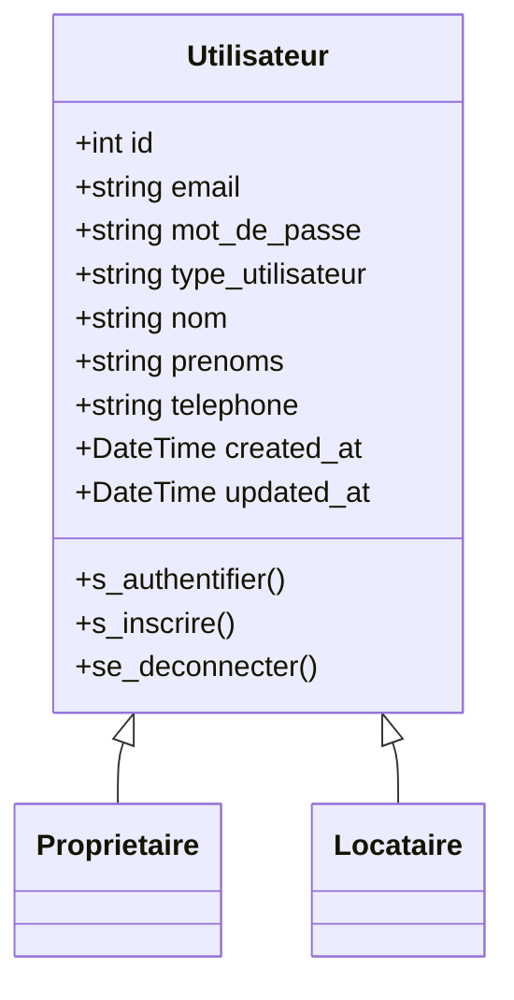
```mermaid
classDiagram
    class Utilisateur {
        +int id
        +string email
        +string mot_de_passe
        +string type_utilisateur
        +string nom
        +string prenoms
        +string telephone
        +DateTime created_at
        +DateTime updated_at
        +s_authentifier()
        +s_inscrire()
        +se_deconnecter()
    }
    
    Utilisateur <|-- Proprietaire
    Utilisateur <|-- Locataire
```

#### Propriétaire
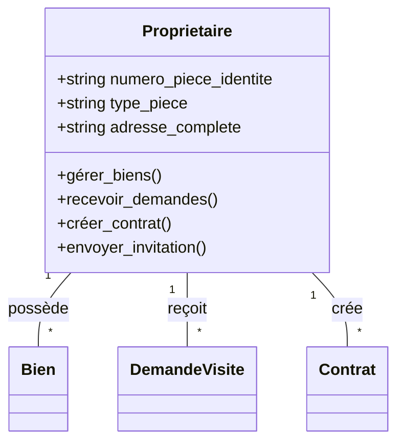
```mermaid
classDiagram
    class Proprietaire {
        +string numero_piece_identite
        +string type_piece
        +string adresse_complete
        +gérer_biens()
        +recevoir_demandes()
        +créer_contrat()
        +envoyer_invitation()
    }
    
    Proprietaire "1" -- "*" Bien : possède
    Proprietaire "1" -- "*" DemandeVisite : reçoit
    Proprietaire "1" -- "*" Contrat : crée
```

#### Locataire
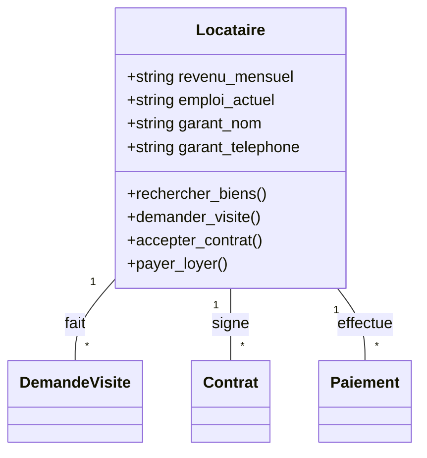
```mermaid
classDiagram
    class Locataire {
        +string revenu_mensuel
        +string emploi_actuel
        +string garant_nom
        +string garant_telephone
        +rechercher_biens()
        +demander_visite()
        +accepter_contrat()
        +payer_loyer()
    }
    
    Locataire "1" -- "*" DemandeVisite : fait
    Locataire "1" -- "*" Contrat : signe
    Locataire "1" -- "*" Paiement : effectue
```

#### Bien
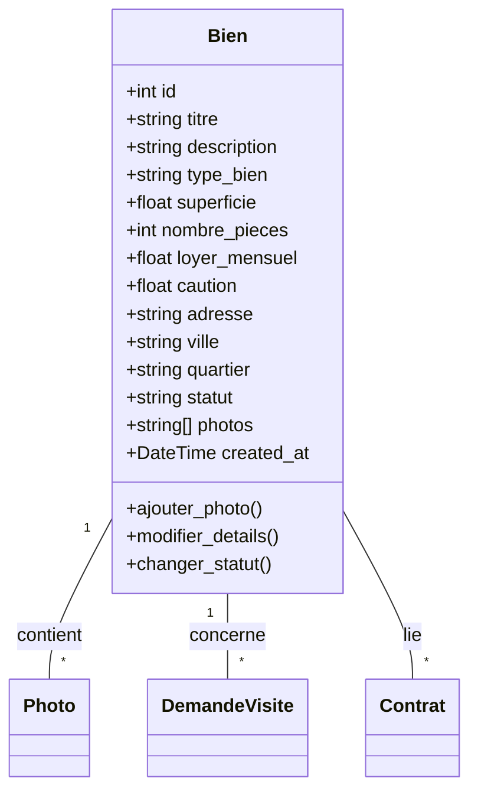
```mermaid
classDiagram
    class Bien {
        +int id
        +string titre
        +string description
        +string type_bien
        +float superficie
        +int nombre_pieces
        +float loyer_mensuel
        +float caution
        +string adresse
        +string ville
        +string quartier
        +string statut
        +string[] photos
        +DateTime created_at
        +ajouter_photo()
        +modifier_details()
        +changer_statut()
    }
    
    Bien "1" -- "*" Photo : contient
    Bien "1" -- "*" DemandeVisite : concerne
    Bien "1" -- "*" Contrat : lie
```

#### DemandeVisite
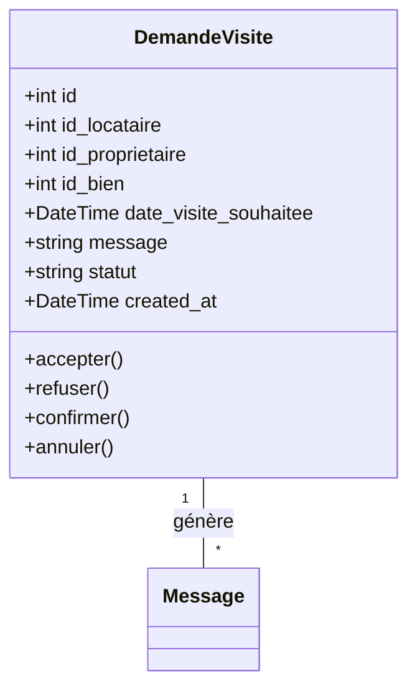
```mermaid
classDiagram
    class DemandeVisite {
        +int id
        +int id_locataire
        +int id_proprietaire
        +int id_bien
        +DateTime date_visite_souhaitee
        +string message
        +string statut
        +DateTime created_at
        +accepter()
        +refuser()
        +confirmer()
        +annuler()
    }
    
    DemandeVisite "1" -- "*" Message : génère
```

#### Contrat
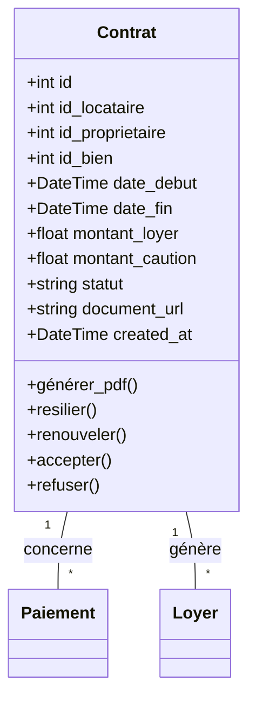
```mermaid
classDiagram
    class Contrat {
        +int id
        +int id_locataire
        +int id_proprietaire
        +int id_bien
        +DateTime date_debut
        +DateTime date_fin
        +float montant_loyer
        +float montant_caution
        +string statut
        +string document_url
        +DateTime created_at
        +générer_pdf()
        +resilier()
        +renouveler()
        +accepter()
        +refuser()
    }
    
    Contrat "1" -- "*" Paiement : concerne
    Contrat "1" -- "*" Loyer : génère
```

#### Paiement
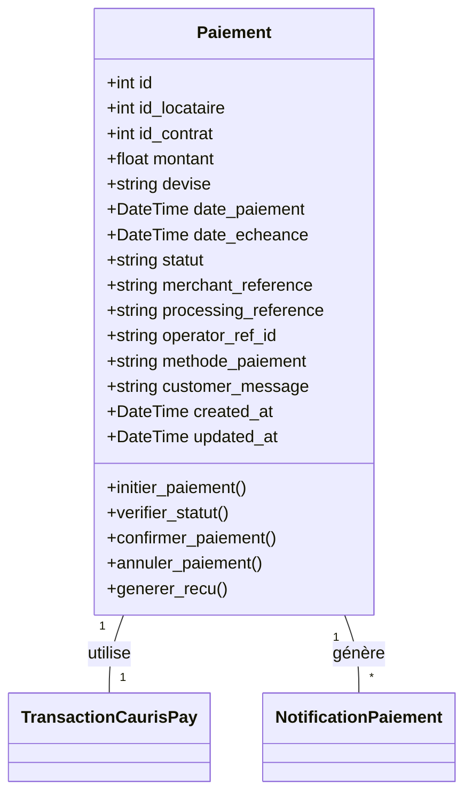
```mermaid
classDiagram
    class Paiement {
        +int id
        +int id_locataire
        +int id_contrat
        +float montant
        +string devise
        +DateTime date_paiement
        +DateTime date_echeance
        +string statut
        +string merchant_reference
        +string processing_reference
        +string operator_ref_id
        +string methode_paiement
        +string customer_message
        +DateTime created_at
        +DateTime updated_at
        +initier_paiement()
        +verifier_statut()
        +confirmer_paiement()
        +annuler_paiement()
        +generer_recu()
    }
    
    Paiement "1" -- "1" TransactionCaurisPay : utilise
    Paiement "1" -- "*" NotificationPaiement : génère
```

#### TransactionCaurisPay
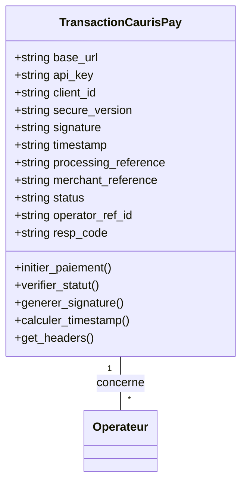
```mermaid
classDiagram
    class TransactionCaurisPay {
        +string base_url
        +string api_key
        +string client_id
        +string secure_version
        +string signature
        +string timestamp
        +string processing_reference
        +string merchant_reference
        +string status
        +string operator_ref_id
        +string resp_code
        +initier_paiement()
        +verifier_statut()
        +generer_signature()
        +calculer_timestamp()
        +get_headers()
    }
    
    TransactionCaurisPay "1" -- "*" Operateur : concerne
```

#### Operateur
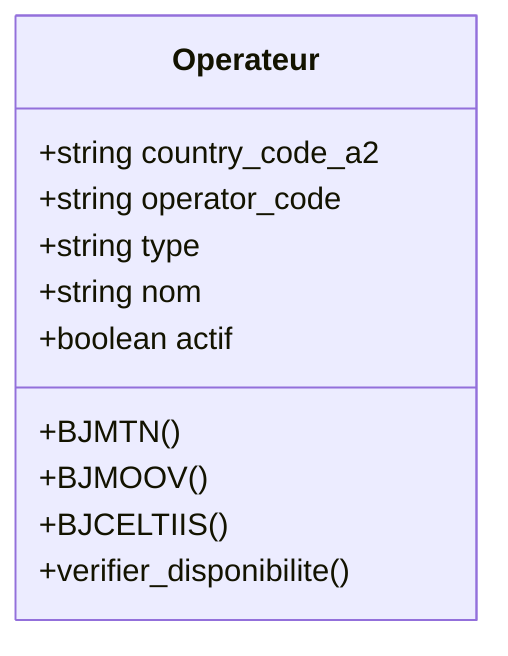
```mermaid
classDiagram
    class Operateur {
        +string country_code_a2
        +string operator_code
        +string type
        +string nom
        +boolean actif
        +BJMTN()
        +BJMOOV()
        +BJCELTIIS()
        +verifier_disponibilite()
    }
```

#### NotificationPaiement
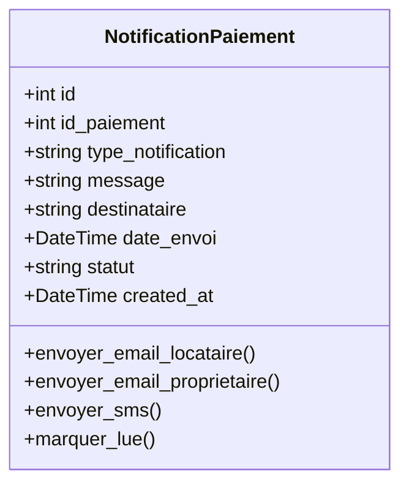
```mermaid
classDiagram
    class NotificationPaiement {
        +int id
        +int id_paiement
        +string type_notification
        +string message
        +string destinataire
        +DateTime date_envoi
        +string statut
        +DateTime created_at
        +envoyer_email_locataire()
        +envoyer_email_proprietaire()
        +envoyer_sms()
        +marquer_lue()
    }
```

#### Loyer
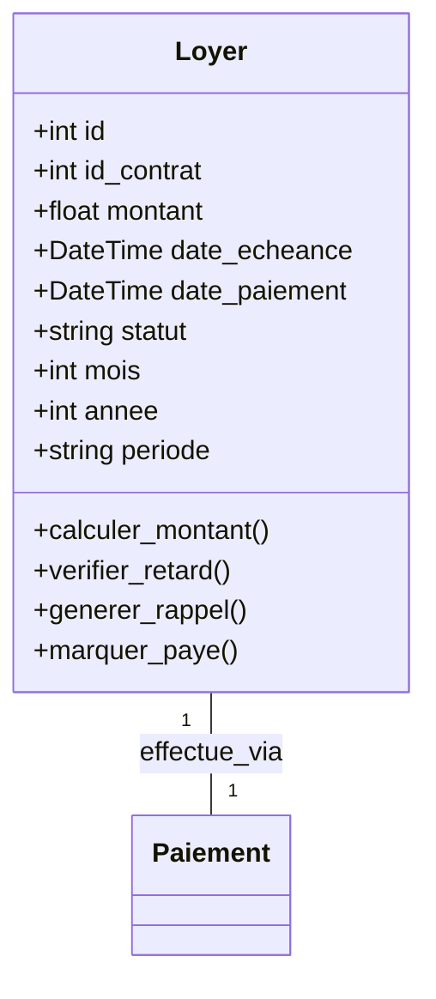
```mermaid
classDiagram
    class Loyer {
        +int id
        +int id_contrat
        +float montant
        +DateTime date_echeance
        +DateTime date_paiement
        +string statut
        +int mois
        +int annee
        +string periode
        +calculer_montant()
        +verifier_retard()
        +generer_rappel()
        +marquer_paye()
    }
    
    Loyer "1" -- "1" Paiement : effectue_via
```

#### Message
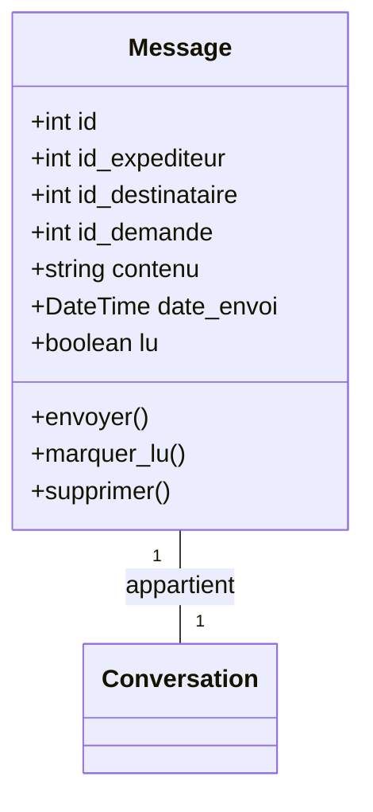
```mermaid
classDiagram
    class Message {
        +int id
        +int id_expediteur
        +int id_destinataire
        +int id_demande
        +string contenu
        +DateTime date_envoi
        +boolean lu
        +envoyer()
        +marquer_lu()
        +supprimer()
    }
    
    Message "1" -- "1" Conversation : appartient
```

#### Conversation
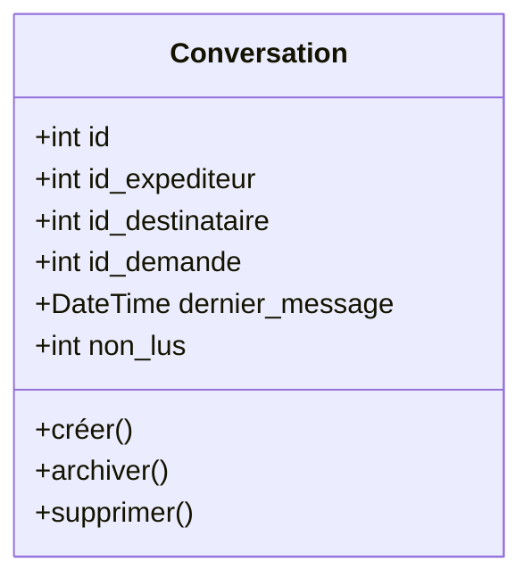
```mermaid
classDiagram
    class Conversation {
        +int id
        +int id_expediteur
        +int id_destinataire
        +int id_demande
        +DateTime dernier_message
        +int non_lus
        +créer()
        +archiver()
        +supprimer()
    }
```

---

## 🔄 Diagramme de Séquence

### Séquence d'Inscription
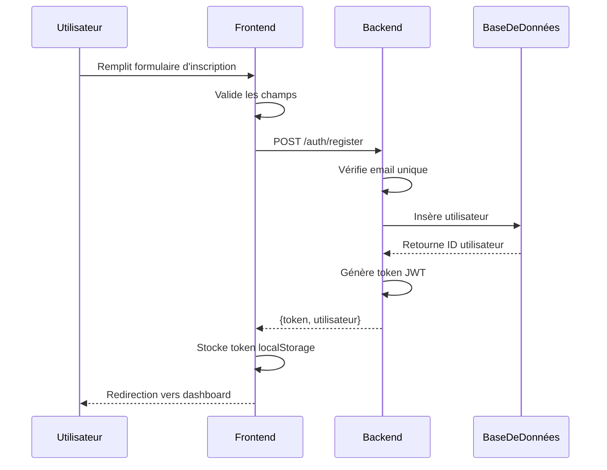
```mermaid
sequenceDiagram
    participant Utilisateur
    participant Frontend
    participant Backend
    participant BaseDeDonnées
    
    Utilisateur->>Frontend: Remplit formulaire d'inscription
    Frontend->>Frontend: Valide les champs
    Frontend->>Backend: POST /auth/register
    Backend->>Backend: Vérifie email unique
    Backend->>BaseDeDonnées: Insère utilisateur
    BaseDeDonnées-->>Backend: Retourne ID utilisateur
    Backend->>Backend: Génère token JWT
    Backend-->>Frontend: {token, utilisateur}
    Frontend->>Frontend: Stocke token localStorage
    Frontend-->>Utilisateur: Redirection vers dashboard
```

### Séquence de Demande de Visite
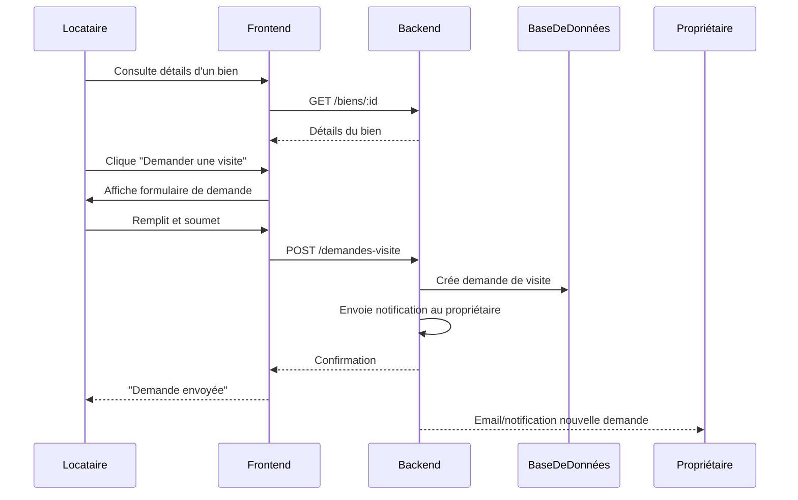
```mermaid
sequenceDiagram
    participant Locataire
    participant Frontend
    participant Backend
    participant BaseDeDonnées
    participant Propriétaire
    
    Locataire->>Frontend: Consulte détails d'un bien
    Frontend->>Backend: GET /biens/:id
    Backend-->>Frontend: Détails du bien
    Locataire->>Frontend: Clique "Demander une visite"
    Frontend->>Locataire: Affiche formulaire de demande
    Locataire->>Frontend: Remplit et soumet
    Frontend->>Backend: POST /demandes-visite
    Backend->>BaseDeDonnées: Crée demande de visite
    Backend->>Backend: Envoie notification au propriétaire
    Backend-->>Frontend: Confirmation
    Frontend-->>Locataire: "Demande envoyée"
    Backend-->>Propriétaire: Email/notification nouvelle demande
```

### Séquence de Messagerie
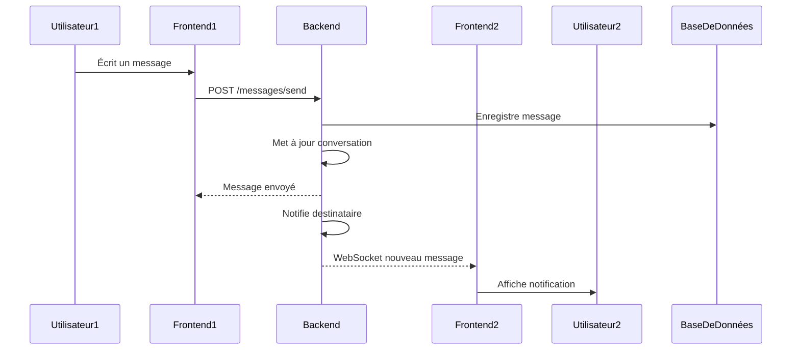
```mermaid
sequenceDiagram
    participant Utilisateur1
    participant Frontend1
    participant Backend
    participant Frontend2
    participant Utilisateur2
    
    Utilisateur1->>Frontend1: Écrit un message
    Frontend1->>Backend: POST /messages/send
    Backend->>BaseDeDonnées: Enregistre message
    Backend->>Backend: Met à jour conversation
    Backend-->>Frontend1: Message envoyé
    Backend->>Backend: Notifie destinataire
    Backend-->>Frontend2: WebSocket nouveau message
    Frontend2->>Utilisateur2: Affiche notification
```

### Séquence de Paiement via API CaurisPay
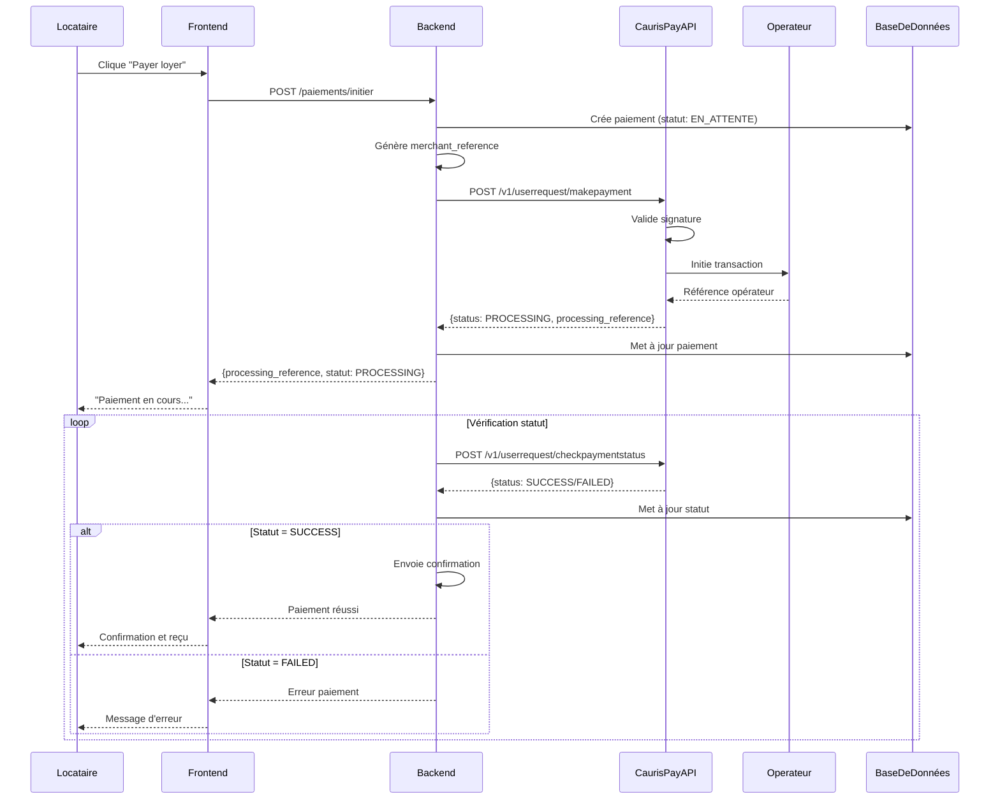
```mermaid
sequenceDiagram
    participant Locataire
    participant Frontend
    participant Backend
    participant CaurisPayAPI
    participant Operateur
    participant BaseDeDonnées
    
    Locataire->>Frontend: Clique "Payer loyer"
    Frontend->>Backend: POST /paiements/initier
    Backend->>BaseDeDonnées: Crée paiement (statut: EN_ATTENTE)
    Backend->>Backend: Génère merchant_reference
    Backend->>CaurisPayAPI: POST /v1/userrequest/makepayment
    CaurisPayAPI->>CaurisPayAPI: Valide signature
    CaurisPayAPI->>Operateur: Initie transaction
    Operateur-->>CaurisPayAPI: Référence opérateur
    CaurisPayAPI-->>Backend: {status: PROCESSING, processing_reference}
    Backend->>BaseDeDonnées: Met à jour paiement
    Backend-->>Frontend: {processing_reference, statut: PROCESSING}
    Frontend-->>Locataire: "Paiement en cours..."
    
    loop Vérification statut
        Backend->>CaurisPayAPI: POST /v1/userrequest/checkpaymentstatus
        CaurisPayAPI-->>Backend: {status: SUCCESS/FAILED}
        Backend->>BaseDeDonnées: Met à jour statut
        alt Statut = SUCCESS
            Backend->>Backend: Envoie confirmation
            Backend-->>Frontend: Paiement réussi
            Frontend-->>Locataire: Confirmation et reçu
        else Statut = FAILED
            Backend-->>Frontend: Erreur paiement
            Frontend-->>Locataire: Message d'erreur
        end
    end
```

### Séquence de Paiement via Widget
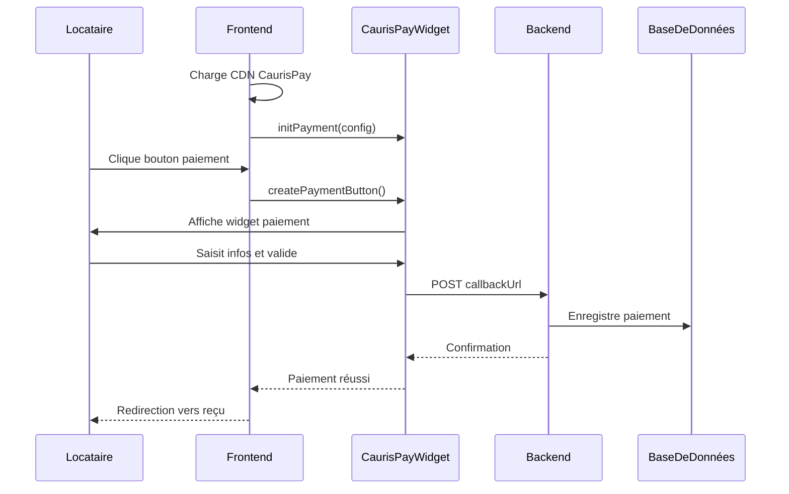
```mermaid
sequenceDiagram
    participant Locataire
    participant Frontend
    participant CaurisPayWidget
    participant Backend
    participant BaseDeDonnées
    
    Frontend->>Frontend: Charge CDN CaurisPay
    Frontend->>CaurisPayWidget: initPayment(config)
    Locataire->>Frontend: Clique bouton paiement
    Frontend->>CaurisPayWidget: createPaymentButton()
    CaurisPayWidget->>Locataire: Affiche widget paiement
    Locataire->>CaurisPayWidget: Saisit infos et valide
    CaurisPayWidget->>Backend: POST callbackUrl
    Backend->>BaseDeDonnées: Enregistre paiement
    Backend-->>CaurisPayWidget: Confirmation
    CaurisPayWidget-->>Frontend: Paiement réussi
    Frontend-->>Locataire: Redirection vers reçu
```

### Séquence de Gestion des Loyers
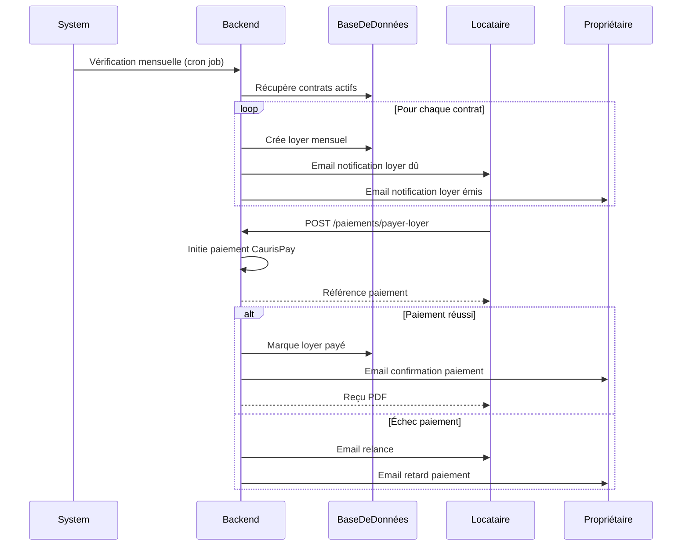
```mermaid
sequenceDiagram
    participant System
    participant Backend
    participant BaseDeDonnées
    participant Locataire
    participant Propriétaire
    
    System->>Backend: Vérification mensuelle (cron job)
    Backend->>BaseDeDonnées: Récupère contrats actifs
    loop Pour chaque contrat
        Backend->>BaseDeDonnées: Crée loyer mensuel
        Backend->>Locataire: Email notification loyer dû
        Backend->>Propriétaire: Email notification loyer émis
    end
    
    Locataire->>Backend: POST /paiements/payer-loyer
    Backend->>Backend: Initie paiement CaurisPay
    Backend-->>Locataire: Référence paiement
    
    alt Paiement réussi
        Backend->>BaseDeDonnées: Marque loyer payé
        Backend->>Propriétaire: Email confirmation paiement
        Backend-->>Locataire: Reçu PDF
    else Échec paiement
        Backend->>Locataire: Email relance
        Backend->>Propriétaire: Email retard paiement
    end
```

---

## 🎯 Diagramme d'Activités

### Flux de Création de Contrat
```mermaid
flowchart TD
    A[Propriétaire connecté] --> B[Sélectionne locataire]
    B --> C[Remplit formulaire contrat]
    C --> D{Validation}
    D -->|Échec| C
    D -->|Succès| E[Génération PDF]
    E --> F[Envoi invitation locataire]
    F --> G[Locataire notifié]
    G --> H[Locataire consulte]
    H --> I{Décision}
    I -->|Accepte| J[Contrat accepté]
    I -->|Refuse| K[Contrat refusé]
    J --> L[Contrat actif]
    L --> M[Suivi des paiements]
    K --> N[Contrat terminé]
```

### Processus de Recherche de Biens
```mermaid
flowchart TD
    A[Locataire connecté] --> B[Page de recherche]
    B --> C[Définit critères]
    C --> D{Type de bien}
    D -->|Appartement| E[Filtre appartements]
    D -->|Maison| F[Filtre maisons]
    D -->|Studio| G[Filtre studios]
    E --> H[Applique prix max]
    F --> H
    G --> H
    H --> I[Applique localisation]
    I --> J[Affiche résultats]
    J --> K{Satisfait?}
    K -->|Non| C
    K -->|Oui| L[Détails du bien]
    L --> M[Demande de visite]
```

### Flux de Paiement de Loyer
```mermaid
flowchart TD
    A[Locataire connecté] --> B[Dashboard paiements]
    B --> C[Sélectionne loyer à payer]
    C --> D[Vérifie montant]
    D --> E{Montant correct?}
    E -->|Non| F[Message d'erreur]
    F --> B
    E -->|Oui| G[Choisit méthode paiement]
    G --> H{Méthode}
    H -->|API Direct| I[Formulaire coordonnées]
    H -->|Widget| J[Ouvre widget CaurisPay]
    I --> K[Validation formulaire]
    J --> L[Authentification opérateur]
    K --> M[Génère signature]
    L --> N[Callback serveur]
    M --> O[Envoie requête API]
    N --> P[Enregistre paiement]
    O --> Q{Réponse API}
    Q -->|PROCESSING| R[Vérification statut]
    Q -->|SUCCESS| S[Confirmation]
    Q -->|FAILED| T[Message erreur]
    R --> U{Statut final?}
    U -->|SUCCESS| S
    U -->|FAILED| T
    S --> V[Génère reçu PDF]
    T --> W[Message à l'utilisateur]
    V --> X[Envoie emails]
    W --> Y[Propose nouvelle tentative]
```

### Processus de Gestion Mensuelle des Loyers
```mermaid
flowchart TD
    A[Début du mois] --> B[Job automatique]
    B --> C[Récupère contrats actifs]
    C --> D{Contrats trouvés?}
    D -->|Non| E[Fin du processus]
    D -->|Oui| F[Pour chaque contrat]
    F --> G[Calcule montant loyer]
    G --> H[Vérifie caution]
    H --> I[Crée échéance loyer]
    I --> J[Statut: EN_ATTENTE]
    J --> K[Envoie notification locataire]
    K --> L[Envoie notification propriétaire]
    L --> M{Autres contrats?}
    M -->|Oui| F
    M -->|Non| N[Fin du processus]
```

### Flux de Remboursement
```mermaid
flowchart TD
    A[Demande remboursement] --> B[Vérification éligibilité]
    B --> C{Éligible?}
    C -->|Non| D[Message refus]
    C -->|Oui| E[Calcul montant]
    E --> F[Vérification solde]
    F --> G[Solde disponible?]
    G -->|Non| H[Message fonds insuffisants]
    G -->|Oui| I[Initie remboursement]
    I --> J[API CaurisPay remboursement]
    J --> K{Réponse API}
    K -->|SUCCESS| L[Confirmation remboursement]
    K -->|FAILED| M[Message erreur]
    L --> N[Mise à jour statut]
    M --> O[Annulation]
    N --> P[Email confirmation]
    O --> Q[Email annulation]
```

---

## 🔄 Diagramme d'États

### État d'une Demande de Visite
```mermaid
stateDiagram-v2
    [*] --> EnAttente
    EnAttente --> Acceptée: Propriétaire accepte
    EnAttente --> Refusée: Propriétaire refuse
    EnAttente --> Annulée: Locataire annule
    Acceptée --> Confirmée: Date confirmée
    Confirmée --> Effectuée: Visite réalisée
    Confirmée --> Annulée: Annulation dernière minute
    Refusée --> [*]
    Annulée --> [*]
    Effectuée --> [*]
```

### État d'un Contrat
```mermaid
stateDiagram-v2
    [*] --> Brouillon
    Brouillon --> Envoyé: Envoyé au locataire
    Envoyé --> Accepté: Locataire accepte
    Envoyé --> Refusé: Locataire refuse
    Accepté --> Actif: Date début atteinte
    Actif --> EnRenouvellement: Approche échéance
    Actif --> Résilié: Résiliation
    EnRenouvellement --> Actif: Renouvelé
    EnRenouvellement --> Terminé: Non renouvelé
    Résilié --> [*]
    Terminé --> [*]
    Refusé --> [*]
```

### État d'un Paiement
```mermaid
stateDiagram-v2
    [*] --> Cree
    Cree --> EnAttente: Initiation
    EnAttente --> Processing: API accepte
    EnAttente --> Annule: Annulation utilisateur
    Processing --> Success: Paiement confirmé
    Processing --> Failed: Échec transaction
    Processing --> Timeout: Délai dépassé
    Success --> RemboursementEnCours: Demande remboursement
    Failed --> EnAttente: Nouvelle tentative
    Failed --> Annule: Abandon
    Timeout --> Annule: Annulation automatique
    RemboursementEnCours --> Rembourse: Remboursement effectué
    RemboursementEnCours --> EchecRemboursement: Erreur remboursement
    EchecRemboursement --> RemboursementEnCours: Nouvelle tentative
    Annule --> [*]
    Rembourse --> [*]
```

### État d'une Transaction CaurisPay
```mermaid
stateDiagram-v2
    [*] --> Initiee
    Initiee --> EnCours: Requête envoyée
    EnCours --> Acceptee: Opérateur confirme
    EnCours --> Rejetee: Opérateur refuse
    EnCours --> Erreur: Erreur technique
    Acceptee --> Complete: Paiement reçu
    Rejetee --> [*]
    Erreur --> [*]
    Complete --> [*]
```

### État d'un Loyer
```mermaid
stateDiagram-v2
    [*] --> Emis
    Emis --> EnAttente: Date échéance atteinte
    EnAttente --> Paye: Paiement reçu
    EnAttente --> Retard: Délai dépassé
    Retard --> Paye: Paiement tardif
    Retard --> Relance: Envoi relance
    Relance --> Paye: Paiement après relance
    Relance --> Poursuite: Procédure légale
    Poursuite --> Paye: Paiement final
    Poursuite --> Recouvrement: Saisie
    Paye --> [*]
    Recouvrement --> [*]
```

---

## 🧩 Diagramme de Composants

### Architecture Frontend
```mermaid
graph TD
    A[App.jsx] --> B[Router]
    B --> C[Layout]
    C --> D[SidebarModern]
    C --> E[Header]
    C --> F[Main Content]
    
    F --> G[Pages Propriétaire]
    F --> H[Pages Locataire]
    F --> I[Pages Communes]
    
    G --> G1[OwnerDashboard]
    G --> G2[ManageProperties]
    G --> G3[VisitRequests]
    G --> G4[InviterLocataire]
    
    H --> H1[TenantDashboard]
    H --> H2[AvailableProperties]
    H --> H3[ContractInvitation]
    H --> H4[TenantMessaging]
    H --> H5[PaymentPage]
    H --> H6[PaymentHistory]
    
    I --> I1[Messaging]
    I --> I2[Profile]
    I --> I3[Login]
    I --> I4[Register]
    I --> I5[PaymentForm]
    I --> I6[PaymentWidget]
    
    J[Contexts] --> J1[AuthContext]
    J --> J2[SearchContext]
    J --> J3[PaymentContext]
    
    K[Services] --> K1[API]
    K --> K2[Auth]
    K --> K3[PaymentService]
    K --> K4[CaurisPayService]
    
    L[Components] --> L1[PaymentButton]
    L --> L2[PaymentStatus]
    L --> L3[PaymentReceipt]
    L --> L4[PaymentMethod]
    L --> L5[OperatorSelector]
```

---

## 🌐 Diagramme de Déploiement

### Architecture Complète
```mermaid
graph TB
    subgraph "Client"
        A[Navigateur Web]
        B[Application React]
    end
    
    subgraph "Serveur Frontend"
        C[Web Server Nginx]
        D[Static Files]
    end
    
    subgraph "Backend"
        E[Node.js Express]
        F[API REST]
        G[JWT Auth]
        H[WebSocket]
    end
    
    subgraph "Base de Données"
        I[PostgreSQL]
        J[Redis Cache]
    end
    
    subgraph "Services Externes"
        K[Email Service]
        L[File Storage]
        M[CaurisPay API]
        N[Mobile Operators]
        O[PDF Generator]
    end
    
    subgraph "Payment Services"
        P[Payment Processor]
        Q[Notification Service]
        R[Reconciliation Service]
    end
    
    A --> C
    C --> D
    C --> E
    E --> F
    F --> G
    F --> H
    F --> I
    E --> J
    F --> K
    F --> L
    F --> M
    F --> P
    P --> M
    P --> N
    P --> Q
    P --> R
    Q --> K
    R --> O
```

---

## 🎭 Diagramme de Contexte

### Vue Système
```mermaid
graph TD
    subgraph "Système de Gestion Immobilière"
        A[Application Web]
        B[Base de Données]
        C[Services Externes]
    end
    
    D[Propriétaire] --> A
    E[Locataire] --> A
    F[Administrateur] --> A
    
    A --> B
    A --> C
    
    C --> D
    C --> E
    C --> F
    
    G[Email Provider] --> C
    H[Payment Provider] --> C
    I[Cloud Storage] --> C
```

### Interactions avec l'Environnement
```mermaid
graph LR
    subgraph "Acteurs Externes"
        A[Propriétaires]
        B[Locataires]
        C[Administrateurs]
    end
    
    subgraph "Système"
        D[Application Web]
        E[API Backend]
        F[Base de Données]
    end
    
    subgraph "Services Tiers"
        G[Service Email]
        H[Service Paiement]
        I[Stockage Fichiers]
    end
    
    A --> D
    B --> D
    C --> D
    D --> E
    E --> F
    E --> G
    E --> H
    E --> I
```

---

## 📊 Métriques et Indicateurs

### KPIs par Acteur
| Acteur | KPIs Principaux | Fréquence |
|--------|----------------|------------|
| Propriétaire | Taux de remplissage, Délai de réponse, Nombre de biens | Quotidien/Hebdomadaire |
| Locataire | Nombre de visites, Taux de conversion, Satisfaction | Quotidien |
| Administrateur | Nombre d'utilisateurs, Temps de réponse, Erreurs système | Quotidien |

### Flux de Données
```mermaid
graph LR
    A[Données Utilisateur] --> B[Validation]
    B --> C[Traitement]
    C --> D[Stockage]
    D --> E[Notification]
    E --> F[Rapports]
```

---

## 🔧 Recommandations Techniques

### Bonnes Pratiques
1. **Validation des données** côté client et serveur
2. **Gestion des erreurs** centralisée
3. **Logging complet** pour le débogage
4. **Sécurité** des endpoints API
5. **Performance** avec cache et pagination

### Outils Recommandés
- **Diagrammes** : PlantUML, Mermaid, Draw.io
- **Documentation** : Swagger/OpenAPI pour l'API
- **Versioning** : Git avec branches par fonctionnalité
- **Testing** : Jest, Cypress, Postman

---

## 📝 Checklist de Validation

### Pour chaque diagramme :
- [ ] Tous les acteurs sont représentés
- [ ] Les interactions sont claires
- [ ] Les flux sont logiques
- [ ] La notation est correcte
- [ ] Les cas limites sont couverts
- [ ] La cohérence avec les autres diagrammes

### Pour l'architecture :
- [ ] Séparation des responsabilités
- [ ] Scalabilité prévue
- [ ] Sécurité intégrée
- [ ] Performance optimisée
- [ ] Maintenance facilitée

---

Ce guide vous fournit une base complète pour créer tous les diagrammes UML nécessaires à votre application de gestion immobilière. Utilisez les outils comme Mermaid, PlantUML ou Draw.io pour créer les diagrammes visuels.
